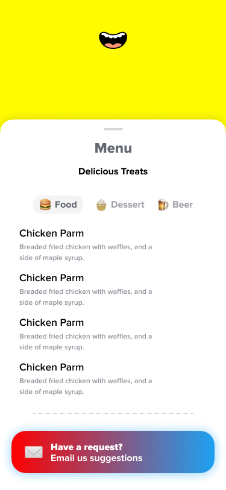

Hi, and welcome to your Popchew takehome. We're psyched that you want be a part of Popchew.

In this directory we have a basic React app set up for you - you'll add a couple features and routes. We've provided some mockups which you should try to replicate, but it doesn't have to be _perfect_. We expect this task to take from 1-4 hours depending on experience.

When you're done, just let us know via email. We'll give feedback on this exercise, and we'd love your feedback on it as well when you're done!

## The Task

The scenario: your company has the skeleton of a React web-app, TrainView, which is used by anonymous London citizens when they are bored on the train to view different food options that could exist. Your company needs you to expand the skeleton to actually show the foods. The app should be mobile-first and responsive for desktop, given that train riders are usually on phones (but not exclusively).

The menu drawer should look like the below mockup. It shows lists of values for three different food items fetched from an API: `food`, `desserts`, and `beer`. You can switch between them by clicking selector pills. The selected pill should have a slightly gray background, while the non-selected pills should blend with the drawer background.

The home screen should look like the below mockup. It displays the user's name and a menu drawer. For name, get the first_name from the Person API below.

The menu drawer should look like the below mockup. It shows lists of _four values_ for three different food items: food, desserts, and beer. You can switch between them by clicking selector pills. The selected pill should have a slightly gray background, while the non-selected pills should blend with the drawer background.

---

_✉️ Email button should email **russell@popchew.com**_

## APIs you’ll need

### Person

[https://reqres.in/api/users/1](https://reqres.in/api/users/1)

Fields: first_name

### Food

[https://random-data-api.com/api/food/random_food](https://random-data-api.com/api/food/random_food)

Fields: dish, description

### Dessert

[https://random-data-api.com/api/dessert/random_dessert](https://random-data-api.com/api/dessert/random_dessert)

Fields: variety, flavor

### Beer

[https://random-data-api.com/api/dessert/random_beer](https://random-data-api.com/api/beer/random_beer)

Fields: name, style
